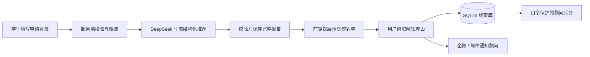

# 途策留学 AI 智能选校与线索转化系统

[](https://www.python.org/)
[](https://fastapi.tiangolo.com/)
[](docs/test-results-2026-09-01.md)
[](deploy/compose.yaml)

面向留学咨询业务的可部署 AI 应用原型：学生用约 30 秒填写申请背景，系统生成冲刺、匹配、保底三档院校建议；用户留资后解锁完整报告，线索同步进入顾问后台，并通过企业微信或邮件通知顾问跟进。

项目重点不是单次调用大模型，而是把 AI 能力接入真实业务流程，完成从用户输入、模型生成、结果校验、报告解锁、线索沉淀到顾问跟进的完整闭环。

> 当前状态：已完成本地业务原型、自动化测试、Docker/Caddy 部署模板和官网嵌入方案；尚未发布到正式域名。AI 推荐仅用于初步申请规划，不构成录取承诺。

## 业务问题

传统免费咨询通常依赖顾问人工收集背景、给出初步选校方向，再整理联系方式进入后续跟进。这个流程存在三个问题：

- 用户首次咨询信息不完整，顾问需要反复补问。
- 初步建议依赖顾问即时响应，获客高峰期容易产生等待。
- 测评结果、联系方式和后续跟进割裂，线索难以统一沉淀。

本项目将流程重构为：



## 我负责的工作

- 将留学测评从页面 Demo 落地为可独立部署的完整应用。
- 设计学生背景 Schema、GPA 计分制和语言成绩校验规则。
- 约束模型输出为三档、每档两所院校的结构化 JSON，并处理空值、重复院校、档位缺失和服务异常。
- 设计服务端报告 ID 与留资关联，避免前端伪造或绕过解锁流程。
- 实现 SQLite 迁移、顾问后台、CSV 导出、企微与邮件通知。
- 增加管理端失败关闭、接口限流、安全响应头、自动备份和 HTTPS 部署模板。
- 编写自动化测试、真实模型冒烟测试及官网嵌入说明。

## 关键工程决策

### 1. 完整报告只保存在服务端

测评接口不会把推荐理由提前发送到浏览器，只返回院校名称和不可预测的 `report_id`。用户提交联系方式后，服务端校验报告 ID，再返回完整报告。

这比前端 CSS 遮罩更可靠：浏览器网络面板中不存在可直接读取的隐藏理由，留资与报告也能形成服务端可追踪关联。

### 2. 将模型输出视为不可信输入

模型使用 JSON mode 返回结果，但服务端仍进行二次校验：

- 必须包含冲刺、匹配、保底三个不同档位。
- 每个档位必须恰好包含两所院校。
- 院校名称和推荐理由不能为空。
- 六所院校标准化后不得重复。
- 无法解析、字段缺失或模型服务失败统一转换为可读的 `502` 响应。

### 3. 明确推荐能力边界

当前版本使用 DeepSeek 根据学生背景生成初步建议，不接入实时招生数据或外部院校知识库。因此提示词禁止模型声称已经核验最新排名、门槛、费用、截止日期或录取概率。

这是一项有意的产品取舍：先验证低成本测评与线索转化闭环，再决定是否投入院校数据治理、检索和推荐评测体系。

### 4. 通知失败不阻塞核心流程

线索先写入数据库，再通过后台任务发送企微和邮件。任一通知渠道失败只记录日志，不回滚已保存的线索，避免第三方服务故障影响用户提交。

### 5. 为单实例原型选择 SQLite

SQLite 让应用无需额外数据库即可部署，并配有备份脚本和 Docker 持久化卷。它适合当前单机构、单进程原型；多实例部署时需要迁移到 PostgreSQL，并将进程内限流替换为 Redis 或网关级共享限流。

## 系统架构

```text
Browser
  ├─ 测评页：原生 HTML / CSS / JavaScript
  └─ 顾问后台：口令登录、统计、刷新、CSV 导出
          │
          ▼
FastAPI
  ├─ Pydantic 输入与输出校验
  ├─ 固定窗口接口限流
  ├─ DeepSeek 调用、超时与重试
  ├─ 报告 ID / 留资关联
  ├─ SQLite 数据访问与兼容迁移
  └─ 企业微信 / SMTP 后台通知
          │
          ▼
Docker + Caddy
  ├─ 非 root 应用容器
  ├─ 健康检查
  ├─ HTTPS 反向代理
  └─ 数据持久化卷
```

## 功能与交付范围

| 能力 | 实现 |
|---|---|
| AI 测评 | 三档 6 校建议、结构化输出、重复与空值校验 |
| 输入治理 | GPA 4/5/100 分制、雅思、托福两种分制、国家和字段长度校验 |
| 报告转化 | 服务端保存报告、名单预览、留资后解锁完整理由 |
| 线索管理 | SQLite 入库、后台查询、统计、CSV 导出 |
| 顾问触达 | 企业微信群机器人、SMTP 邮件、通知失败隔离 |
| 安全控制 | 管理口令失败关闭、恒定时间比较、基础限流、安全响应头、禁止缓存敏感响应 |
| 部署运维 | Docker、非 root 用户、健康检查、Caddy HTTPS、持久化卷、备份脚本 |
| 官网集成 | 独立页面、悬浮组件、iframe 预览与跨域边界说明 |

## 测试与验证

详细记录见 [`docs/test-results-2026-09-01.md`](docs/test-results-2026-09-01.md)。

已完成：

- 39 项 `pytest` 自动化测试，覆盖输入校验、模型结果结构、报告关联、管理鉴权、数据库迁移、通知内容和接口限流。
- 一次真实 DeepSeek 端到端调用，观察耗时 3.51 秒；该结果仅代表单次本地测试，不作为性能承诺。
- 前端脚本语法检查、错误恢复、移动端布局及后台登录检查。
- 冒烟脚本覆盖健康检查、真实测评、留资入库、后台读取与页面访问。

尚未完成：

- 正式生产环境的负载测试和长期可用性监控。
- 推荐质量黄金数据集、院校事实正确率和不同模型的离线对比。
- 浏览器环境下带虚构联系方式的完整解锁及 CSV 有数据验收。

运行自动化测试：

```bash
cd agent
python -m pytest
```

服务启动后运行端到端冒烟测试：

```bash
bash scripts/smoke_test.sh
```

## 快速开始

环境要求：Python 3.10+

```bash
cd agent
python3 -m venv .venv
.venv/bin/pip install -r requirements.txt
cp .env.example .env
# 在 .env 中填写 DEEPSEEK_API_KEY 和强随机 ADMIN_TOKEN
.venv/bin/python -m uvicorn app.main:app --port 8000
```

启动后访问：

- 用户测评页：<http://localhost:8000>
- 顾问后台：<http://localhost:8000/admin>
- API 文档：<http://localhost:8000/docs>

## Docker 部署

仓库提供应用容器、Caddy HTTPS 代理和持久化卷配置：

```bash
cd deploy
cp ../agent/.env.example .env
# 设置 DEEPSEEK_API_KEY、ADMIN_TOKEN 和 EVALUATION_DOMAIN
docker compose up -d --build
```

正式接入 `tuce.asia` 的悬浮组件、独立子域名和备份方案见 [`docs/tuce-integration.md`](docs/tuce-integration.md)。当前配置是部署模板，尚未发布正式官网。

## 配置

| 变量 | 必填 | 说明 |
|---|---:|---|
| `DEEPSEEK_API_KEY` | 是 | DeepSeek API Key |
| `DEEPSEEK_BASE_URL` | 否 | 默认 `https://api.deepseek.com` |
| `DEEPSEEK_MODEL` | 否 | 默认 `deepseek-chat` |
| `ADMIN_TOKEN` | 是 | 顾问后台和模型连通检查口令；未设置时管理接口拒绝访问 |
| `WECOM_WEBHOOK_URL` | 否 | 企业微信群机器人 webhook |
| `SMTP_HOST` / `SMTP_PORT` | 否 | SMTP 服务器配置 |
| `SMTP_USER` / `SMTP_PASSWORD` | 否 | 发件账号与授权码 |
| `NOTIFY_EMAIL_TO` | 否 | 顾问收件地址，多个地址用逗号分隔 |
| `RATE_LIMIT_WINDOW_SECONDS` | 否 | 限流窗口，默认 600 秒 |
| `EVALUATE_RATE_LIMIT` | 否 | 单来源窗口内最多测评次数，默认 10 |
| `LEAD_RATE_LIMIT` | 否 | 单来源窗口内最多留资次数，默认 20 |

## API

| 方法 | 路径 | 用途 |
|---|---|---|
| `GET` | `/health` | 健康检查 |
| `GET` | `/api/v1/ping-deepseek` | 需管理口令的模型链路检查 |
| `POST` | `/api/v1/evaluate` | 生成推荐，返回院校名单与 `report_id` |
| `POST` | `/api/v1/leads` | 保存联系方式并解锁关联报告 |
| `GET` | `/api/v1/leads` | 需管理口令的线索列表 |
| `DELETE` | `/api/v1/leads` | 需管理口令及确认头，清除全部留资并保留报告 |

接口参数和响应模型可在服务启动后通过 `/docs` 查看。

## 项目边界与下一步

当前版本定位为可运行的业务原型，而非完整商用 SaaS。正式投入生产前还需要：

1. 建立脱敏的专家标注测评集，评估推荐相关性、事实正确率、档位合理性和模型回归。
2. 接入经过版本管理的院校与专业数据，并为推荐结论提供可追溯引用。
3. 将 SQLite 迁移至 PostgreSQL，支持并发、多实例和可靠的数据生命周期管理。
4. 增加用户隐私授权、线索删除、保存期限、审计日志和角色权限。
5. 增加结构化日志、trace ID、模型延迟、token 成本、错误率与告警。

## 目录结构

```text
study-abroad-evaluation/
├── agent/
│   ├── app/
│   │   ├── main.py              # API、限流中间件与异常处理
│   │   ├── schemas.py           # 输入、输出与跨字段校验
│   │   ├── db.py                # SQLite、报告关联与兼容迁移
│   │   ├── rate_limit.py        # 单实例固定窗口限流
│   │   └── services/
│   │       ├── deepseek.py      # 模型调用、超时与重试
│   │       ├── selector.py      # 提示词、结构化解析与结果校验
│   │       └── notify.py        # 企微与邮件通知
│   ├── tests/test_core_flow.py  # 核心流程自动化测试
│   └── .env.example
├── web/static/                  # 用户页、顾问后台与官网嵌入组件
├── deploy/                      # Docker Compose 与 Caddy HTTPS
├── docs/                        # 测试证据与官网接入说明
├── scripts/                     # 冒烟测试和 SQLite 备份
└── Dockerfile
```

## 隐私与安全

- 不要提交 `.env`、API Key、Webhook、SMTP 授权码或 `data/leads.db`。
- 线索包含微信号、手机号等个人信息，正式使用前必须取得授权并明确保存和删除规则。
- `ADMIN_TOKEN` 必须使用强随机值；当前方案适合单机构后台，不等同于完整用户与权限系统。
- 应用限流仅在单进程内生效，多进程或多实例部署需使用共享限流。

## License

该仓库是业务原型。公开使用或二次分发前，请先确认项目数据、品牌素材与业务代码的授权范围。
