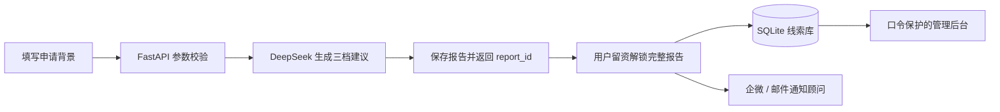

# 途策留学 · AI 智能选校测评

[](https://www.python.org/)
[](https://fastapi.tiangolo.com/)
[](https://www.deepseek.com/)

一个可独立部署的留学选校与线索转化应用。学生填写 GPA、专业和目标国家/地区后，系统通过 DeepSeek 生成冲刺、匹配、保底三档院校建议；用户解锁完整报告后，线索会写入本地数据库，并可通过企业微信和邮件通知顾问。

> 本项目是途策留学的业务原型。AI 生成结果仅供申请规划参考，不构成录取承诺。

## 功能亮点

- **30 秒完成测评**：核心信息精简，支持院校背景、学位与语言成绩等选填项
- **三档选校建议**：生成冲刺、匹配、保底共 6 所院校及推荐理由
- **报告解锁闭环**：服务端保存报告并关联联系方式，避免前端伪造报告编号
- **顾问及时跟进**：支持企业微信群机器人和 SMTP 邮件异步通知
- **线索管理后台**：口令保护、数据统计、刷新与 CSV 导出
- **无需前端构建**：FastAPI 同时提供 API 和静态页面，适合快速部署

## 核心流程

1. 学生填写 GPA + 申请专业 + 目标国家
2. AI 返回三档（冲刺 / 匹配 / 保底）共 6 所学校 + 推荐理由
3. 完整理由被模糊遮罩，需留微信 / 手机号解锁
4. 留资写入 SQLite 并展示完整报告 + 感谢页
5. 后台异步推送企微群消息 + 邮件给顾问



## 技术栈

- 后端：Python + FastAPI（含静态文件托管）
- AI：DeepSeek API（openai SDK 兼容调用，带超时与自动重试）
- 通知：企业微信群机器人 webhook + SMTP 邮件（任一失败不影响留资）
- 数据存储：SQLite（单文件 `data/leads.db`）
- 前端：原生 HTML / CSS / JS（无构建步骤）

## 目录结构

```
study-abroad-evaluation/
├── agent/                  # 后端（FastAPI）
│   ├── app/
│   │   ├── main.py         # 入口：路由 + 统一异常处理（422/502/500 中文提示）
│   │   ├── config.py       # 环境变量配置
│   │   ├── schemas.py      # Pydantic 模型：输入校验
│   │   ├── db.py           # SQLite 留资存储
│   │   └── services/
│   │       ├── deepseek.py # DeepSeek 调用（超时/重试）
│   │       ├── selector.py # 选校引擎（JSON 解析、档位归一化）
│   │       └── notify.py   # 企微 + 邮件通知
│   ├── .env.example        # 配置模板（复制为 .env 填写）
│   └── requirements.txt
├── web/static/             # 前端页面（index.html / admin.html / app.js / admin.js / style.css）
├── data/leads.db           # 留资数据库（自动创建，已被 gitignore）
└── scripts/smoke_test.sh   # 全链路冒烟测试
```

## 快速开始

环境要求：Python 3.10+

```bash
cd agent
python3 -m venv .venv
.venv/bin/pip install -r requirements.txt

cp .env.example .env   # 填写 DEEPSEEK_API_KEY（通知配置可选，见下表）

.venv/bin/python -m uvicorn app.main:app --port 8000
```

启动后可访问：

- 用户测评页：<http://localhost:8000>
- 线索管理后台：<http://localhost:8000/admin>
- Swagger API 文档：<http://localhost:8000/docs>

## 配置项（agent/.env）

| 变量 | 必填 | 说明 |
|------|------|------|
| `DEEPSEEK_API_KEY` | ✅ | DeepSeek API Key |
| `DEEPSEEK_BASE_URL` | - | 默认 `https://api.deepseek.com` |
| `DEEPSEEK_MODEL` | - | 默认 `deepseek-chat` |
| `WECOM_WEBHOOK_URL` | 可选 | 企业微信群机器人 webhook（留空则跳过企微通知） |
| `SMTP_HOST` / `SMTP_PORT` | 可选 | SMTP 服务器（QQ 邮箱：`smtp.qq.com`，端口 465） |
| `SMTP_USER` / `SMTP_PASSWORD` | 可选 | 发件邮箱 + SMTP 授权码（非登录密码） |
| `NOTIFY_EMAIL_TO` | 可选 | 收件顾问邮箱，多个用英文逗号分隔 |
| `ADMIN_TOKEN` | 可选 | 数据查看界面（/admin.html）访问口令。留空则开放访问，**公网部署务必设置** |

通知渠道留空不影响测评和留资，只是顾问收不到对应提醒。修改配置后需重启服务。

## API 一览

| 方法 | 路径 | 说明 |
|------|------|------|
| GET | `/health` | 健康检查 |
| GET | `/api/v1/ping-deepseek` | DeepSeek 链路连通性验证 |
| POST | `/api/v1/evaluate` | 选校测评：`{gpa, major, target_country, school_tier?, degree?, language_type?, language_score?}` → 三档 6 校及服务端 `report_id` |
| POST | `/api/v1/leads` | 留资：`{wechat, phone, report_id?, gpa?, major?, target_country?, school_tier?, degree?, language_type?, language_score?}` → `{id, message}` |
| GET | `/api/v1/leads` | 线索列表（数据查看界面用）：需请求头 `X-Admin-Token` 携带口令（配置了 `ADMIN_TOKEN` 时） |

错误统一为 `{"detail": "中文提示"}`：参数校验失败 422、AI 服务不可用 502、其他异常 500。

## 数据查看

浏览器打开 <http://localhost:8000/admin.html>（或 `/admin`）查看全部留资线索：表格展示联系方式与测评背景（含选填维度），支持刷新、统计、导出 CSV。

- 配置了 `ADMIN_TOKEN`：首次打开需输入口令（与 `.env` 中一致），口令保存在当前浏览器标签页会话中。
- 未配置 `ADMIN_TOKEN`：直接开放访问，仅适合内网 / 开发环境，公网部署务必设置口令。

## 测试

运行自动化测试：

```bash
cd agent
.venv/bin/python -m pytest
```

服务启动后执行全链路冒烟测试（含真实 DeepSeek 调用，约 1 分钟）：

```bash
bash scripts/smoke_test.sh
# 指定地址：BASE_URL=http://your-server:8000 bash scripts/smoke_test.sh
# 配置了 ADMIN_TOKEN 时需透传口令：TOKEN=你的口令 bash scripts/smoke_test.sh
```

覆盖：健康检查、GPA/手机号等参数校验、测评真实调用、服务端报告关联、留资入库（含选填字段）、线索列表、数据查看页、首页可访问。

## 隐私与安全

- 不要提交 `agent/.env`、真实 API Key、Webhook、SMTP 授权码或 `data/leads.db`；这些文件已在 `.gitignore` 中排除。
- 公网部署前必须设置强随机 `ADMIN_TOKEN`，并通过 HTTPS 提供服务。
- 线索数据包含微信号、手机号等个人信息。请依据适用的隐私法规取得用户授权，并设置访问控制、保存期限和删除流程。
- 当前 SQLite 方案适合单实例和轻量使用；多实例部署时建议迁移到 PostgreSQL 等集中式数据库。

## 部署（生产）

SQLite 单文件存储，单进程即可，无需额外中间件。示例（服务器上）：

```bash
cd agent
.venv/bin/python -m uvicorn app.main:app --host 0.0.0.0 --port 8000
```

长期运行二选一：

**nohup**（最简单）：

```bash
nohup .venv/bin/python -m uvicorn app.main:app --host 0.0.0.0 --port 8000 >> ../uvicorn.log 2>&1 &
```

**systemd**（推荐，开机自启 / 崩溃自动拉起）：`/etc/systemd/system/school-eval.service`

```ini
[Unit]
Description=School Evaluation Tool
After=network.target

[Service]
WorkingDirectory=/opt/study-abroad-evaluation/agent
ExecStart=/opt/study-abroad-evaluation/agent/.venv/bin/python -m uvicorn app.main:app --host 0.0.0.0 --port 8000
Restart=always
RestartSec=5

[Install]
WantedBy=multi-user.target
```

```bash
sudo systemctl daemon-reload && sudo systemctl enable --now school-eval
```

其他建议：

- **反代 + HTTPS**：前端含表单收集联系方式，公网环境建议用 Nginx / Caddy 反代并配置 HTTPS；静态页面已由 FastAPI 托管，反向代理只需转发 8000 端口即可。
- **数据库备份**：定期备份 `data/leads.db`（留资线索的唯一存储），如 `cp data/leads.db data/backups/leads-$(date +%F).db`。
- **日志**：系统日志中关键字 `未处理异常`、`企微通知失败`、`邮件通知失败` 可用于排障。

## 项目状态与参与方式

项目目前处于可运行的业务原型阶段，欢迎通过 GitHub Issues 提交问题或建议，也欢迎提交 Pull Request。提交改动前请先运行自动化测试，并确保示例配置中不包含真实凭据或用户数据。

当前版本主要面向单机构、单实例部署，尚未包含用户账号、多租户、线索删除流程、限流和生产级监控。正式商用前应补齐隐私授权、数据生命周期管理、接口限流与可观测性。

## 常见问题

- **启动报 venv 脚本路径错误（No such file or directory）**：项目目录曾被重命名，venv 内脚本 shebang 指向旧路径。用 `.venv/bin/python -m uvicorn ...` 启动即可。
- **测评接口 502**：DeepSeek key 失效 / 余额不足 / 网络不通，重试 2 次后返回「AI 服务暂时不可用」；`/api/v1/ping-deepseek` 可单独验证连通性。
- **留资成功但顾问没收到通知**：检查 `.env` 通知配置是否已填（留空则静默跳过），重启服务后生效；通知失败不影响留资入库。
